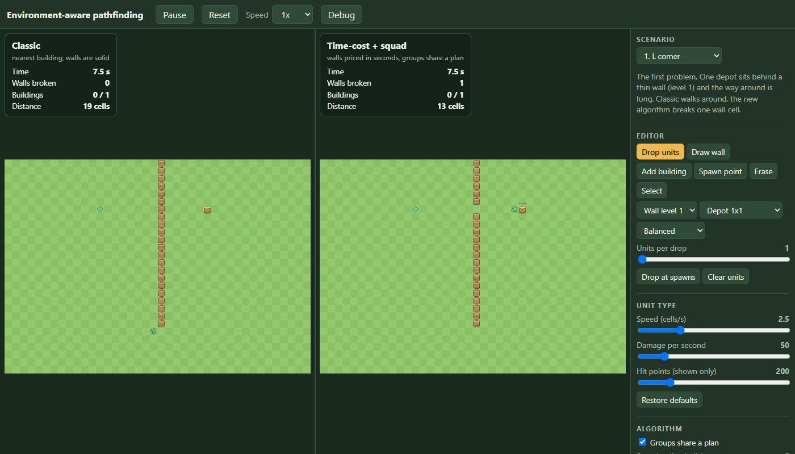
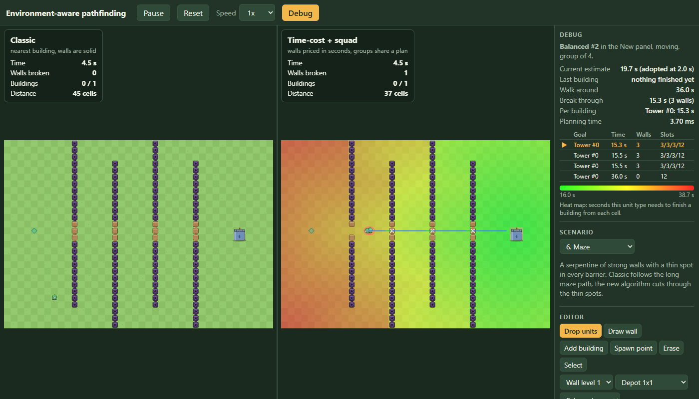
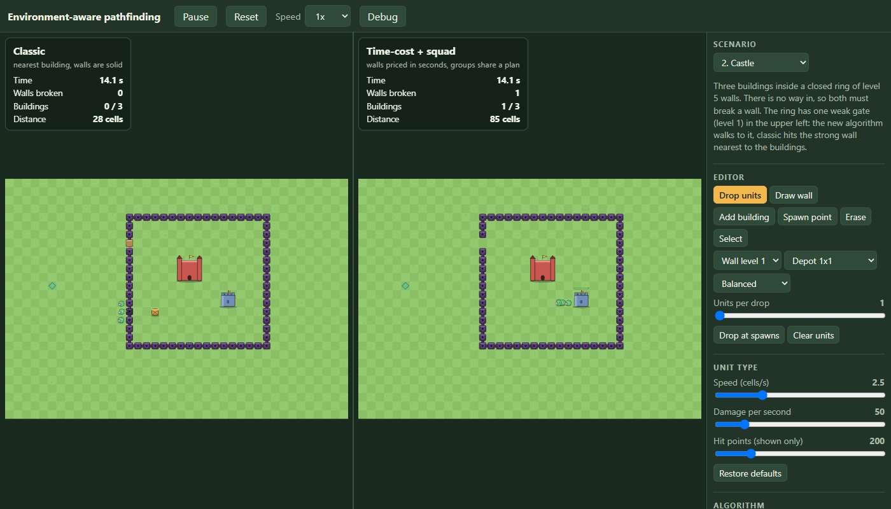

# environment-aware pathfinding

Pathfinding that treats the environment as a **decision input**, not a fixed obstacle map: breaking, crossing or walking around a wall is compared by real time cost. A browser demo runs a classic AI and the new algorithm side by side on the same map, with the same units and the same deploy events.



## The problem

Many games already have a rule for walls: when the way around gets very long, the unit gives up on it and attacks the wall. The rule is usually a fixed limit (a path longer than N cells, or no path at all), not a comparison of what breaking the wall costs against what walking costs. So it fires at the wrong moment: a long walk around a wall a few hits would remove, or hits on a thick wall beside a short way around. Time is lost either way, and finding a long path only to drop it costs computing time too. This is an observation from playing such games, not a measurement, and no real game's code was read.

The classic AI here is the simplest form of that behavior: nearest building by straight line, walls are solid, and a wall is hit only when no path exists. A version with a path-length limit is not built; it would be a third planner if it turns out to be the fairer opponent.

## The approach

Everything is priced in **seconds**.

- **Time cost.** Walking into a cell costs `length * moveCost / speed`. A wall cell adds `wallHp / dps`. A building is approached, and destroying it costs `buildingHp / dps`. One multi-source reverse Dijkstra (`src/sim/planner/flowField.ts`) starts from the free cells around every building and floods the map, so every cell holds "seconds until this unit has destroyed its cheapest building" plus the next cell to step to. Target and route come out of the same table.
- **Squads.** Units within 5 cells of each other, directly or through a chain, share one decision: same goal, same walls to break, damage adds up.
- **Attack slots.** A target has only as many attack positions as free cells around it that the squad can reach, one attacker per cell. The simulation enforces it (a troop on a taken cell walks to the nearest free position or waits), and the planner counts slots with the same function. 50 troops break a one-position wall no faster than 1.
- **Rollout.** Up to 6 candidate plans per squad (best route, full detour, other buildings, banned walls) are scored by an event-based forward estimate: arrival times, slots, break time of every wall on the route, then the building. No simulation steps.
- **Stability.** A squad keeps its plan unless the best candidate is at least 10% faster; a squad that already started hitting keeps its plans until the target falls.
- **Extensible environment.** Cell behavior (`passable`, `breakable`, `blocked`, move cost) comes only from `src/sim/environment.ts`. A test registers a new slow terrain and the planner and movement use it without any change.

## Run it

```
npm install
npm run dev       # the demo, http://localhost:5173
npm run build     # tsc --noEmit + production build into dist/
npm run preview   # serve dist/
npm test          # 105 tests
npm run bench     # flow field and squad planning timing
```

The build uses relative asset paths, so `dist/` works from any sub-path. `.github/workflows/deploy.yml` builds, tests and publishes it to GitHub Pages on every push to `main` (turn Pages on in the repository settings, source "GitHub Actions").

### In the demo

- **Scenario menu** with 9 ready-made maps and a blank one. Each has a short description of what it shows.
- **Editor** (right panel): draw walls of level 1-5, add buildings (1x1, 2x2, 3x3), spawn points, erase, select an object to change its hit points. Drop units by clicking either map, several at once, or at the spawn points; they land on the same cell at the same time in both panels and Reset replays them.
- **Settings:** unit speed / damage / hit points, group behavior on and off, squad radius, number of candidate plans, wall hit point multiplier. Changing one resets the run.
- **Debug button:** click a unit to see a heat map of the cost field, its planned route (blue = walking, green = breaking a wall), rings around units that share a plan, the candidate plans with time, walls and slots, walking against breaking, estimate against real time, and planning time.



## Results

Time to destroy every building, in simulated seconds (`npm test` prints these). Same map, same units, same deploy events:

| Scenario | Classic | New | Difference |
|---|---|---|---|
| 1. L corner: thin wall, long way around | 21.07 | 13.33 | 37% faster |
| 2. Castle: ring of level 5 walls with one weak gate | 43.30 | 34.50 | 20% faster |
| 3. Double layer: strong inner ring with a weak far door | 63.60 | 30.47 | 52% faster |
| 4. Mixed levels: weak stretch off the straight line | 46.90 | 29.17 | 38% faster |
| 5. No way in: closed by level 3 walls | 20.37 | 19.73 | 3% faster (both must break in) |
| 6. Maze: serpentine with thin spots | 47.33 | 20.13 | 57% faster |
| 7. Crowd effect: one unit against a level 4 wall | 21.07 | 21.07 | same (1 or 2 units walk around, 3 or more break the wall) |
| 8. Reinforcements: 3 units, 10 more 2.5 s later | 17.00 | 14.63 | 14% faster |
| 9. Narrow passage: 20 units, tunnel closed by a two-cell barrier | 38.10 | 38.10 | same (one attacker fits at each barrier cell) |



More detail:

- **Single unit, L-corner, every unit type and wall level:** the new algorithm breaks the wall exactly where breaking is faster (a level 1 wall for a fast unit, up to level 5 for a heavy one) and walks around otherwise; its own time estimate is within 1.0% of the real time.
- **Crowd threshold:** level 4 wall, balanced units: 1 walks around, 2 break (15.13 s against classic's 16.63 s), 8 break (10.17 s against 14.90 s).
- **Attack slots:** a wall with 1 free position falls in 22.03 s for 3, 8 and 50 troops alike; one with 3 positions in 9.00 s.
- **Oracle:** on 200 random 15x15 maps every candidate plan is run in the real simulation. The planner's pick is within 5% of the best candidate in 199 of 200 maps (worst 1.052), estimate error 1.2%. On two fresh sets of 200 maps: 199 and 199 within 5%, worst 1.146 and 1.107.
- **Speed:** one flow field 0.57 ms (40x28) and 6.0 ms (100x100). A full squad planning round on a busy 40x28 map (10 squads, 50 troops) takes 25 ms, about 2.4 ms per squad.
- **Rendering:** with 30 units in both panels, 19.5 ms per frame (about 51 fps), 26.1 ms with debug on, in headless Chrome with software WebGL at 1400x800. JavaScript takes under 1 ms of that. A real GPU is not measured.

## Limits

- Candidates are scored by when their own target falls, so the order of buildings is greedy (a walled depot next to an open one finishes in 68.20 s, the same as the single-unit planner).
- A full squad planning round misses the 3 ms target (25 ms for 10 squads). Caching fields, or asking only the affected squads, would be the next step.
- The oracle compares the planner's candidates with each other, not with every possible plan.
- Slot counting for later walls in a row is approximate (earlier walls are treated as gone, other groups' positions are not predicted).
- Attack positions are the 8 neighbors of a target's footprint.
- Only walls are breakable environment: no gates, traps, defensive buildings or damage to units.
- The deploy workflow has not run yet (nothing was pushed), so the published page is unchecked.

## Project layout

```
src/sim/        pure simulation (no DOM, no Pixi): grid, world, troops, planners
  planner/      flow field, squads, slots, break time, rollout, squad planner
  ai/           the classic AI
src/render/     PixiJS drawing: cartoon style, effects, debug layers (reads the world, never writes)
src/ui/         session (fixed time step, both worlds), editor, sidebar, debug panel
src/scenarios/  the ready-made maps
tests/          vitest: sim, planners, oracle, scenarios, editor, session
bench/          timing runs (npm run bench)
```

The simulation is deterministic: the same scenario and deploy events give the same result, whatever the frame rate. A test runs the same session at different frame rates and after a reset and compares every event.
