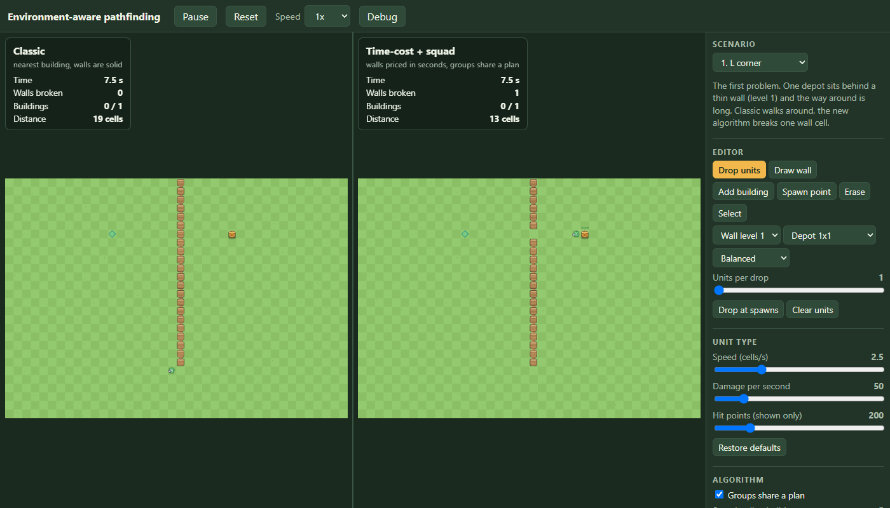

# environment-aware-pathfinding

Pathfinding that treats walls as a cost, not as fixed obstacles. For each wall, breaking through, walking around or choosing another target is compared by real time cost. A browser demo runs a classic AI and this planner side by side on the same map with the same units.

Demo: https://kaan0d.github.io/environment-aware-pathfinding/



## Problem

Game AI usually attacks a wall only when no path exists or the path passes a fixed length limit. It never compares breaking time with walking time, so units walk long detours around weak walls or hit thick walls next to short paths. The classic AI here is the simplest version of that: nearest building, solid walls, break only when no path exists.

## Approach

Every cost is in **seconds**.

- **Flow field:** one multi-source reverse Dijkstra (`src/sim/planner/flowField.ts`) starts from the cells around every building. Moving costs `length * moveCost / speed`, a wall adds `wallHp / dps`, and a building adds `buildingHp / dps`. Each cell stores the time to its cheapest kill and the next step, so the target and the route come from one table.
- **Squads:** units within 5 cells of each other share one plan, and their damage adds up.
- **Rollout:** up to 6 candidate plans per squad (best route, full detour, other targets, banned walls) are scored by an event-based estimate of arrivals, attack slots and break times, without running simulation steps.
- **Hysteresis:** a squad switches plans only for a candidate at least 10% faster.
- **Attack slots:** optionally one attacker per free cell around a target. The planner and the simulation count slots with the same function.
- **Extensible terrain:** cell behavior comes only from `src/sim/environment.ts`.

The simulation is deterministic and independent of frame rate.

## Results

Seconds to destroy every building (same map, same units, cells shared):

| Scenario | Classic | New | Difference |
|---|---|---|---|
| L corner | 21.07 | 13.33 | 37% faster |
| Castle, one weak gate | 42.90 | 33.37 | 22% faster |
| Double layer | 28.67 | 21.13 | 26% faster |
| Mixed wall levels | 31.43 | 26.43 | 16% faster |
| Fully enclosed | 17.60 | 16.50 | 6% faster |
| Maze with thin spots | 47.13 | 17.80 | 62% faster |
| Reinforcements | 16.17 | 10.83 | 33% faster |
| Crowd effect, one unit | 21.07 | 21.07 | same |
| Narrow passage, 20 units | 13.40 | 13.40 | same |

With one attacker per slot, the new planner also wins or ties every scenario.

- **Estimate accuracy:** within 1.0% of simulated time for a single unit, and 0.8–1.2% on 200 random maps.
- **Oracle:** on 200 random 15x15 maps, every candidate plan was run in the full simulation. The chosen plan was within 5% of the best candidate on 199–200 of 200 maps.
- **Speed:** one flow field takes 0.57 ms on a 40x28 grid and 6.0 ms on 100x100. A full planning round (10 squads, 50 units) takes 25 ms.

## Run

```
npm install
npm run dev       # http://localhost:5173
npm run build     # typecheck + production build
npm test          # Vitest
npm run bench     # planner timing
```

The demo includes 9 scenarios, a map editor, unit and planner settings, and a debug view (cost heat map, planned route, candidate plans, estimated vs. actual time).

## Limits

- Building order is greedy: each candidate is scored by when its own target falls.
- A planning round takes 25 ms for 10 squads, above the 3 ms target. Field caching and partial replanning are the next step.
- The oracle compares candidates with each other, not with every possible plan.
- Walls are the only breakable environment.

## Layout

```
src/sim/        deterministic simulation (no DOM): grid, world, troops
  planner/      flow field, squads, slots, rollout
  ai/           classic AI
src/render/     PixiJS rendering and debug layers (read-only)
src/ui/         session loop, editor, sidebar
src/scenarios/  ready-made maps
tests/ bench/
```

## License

MIT, see [LICENSE](LICENSE).
